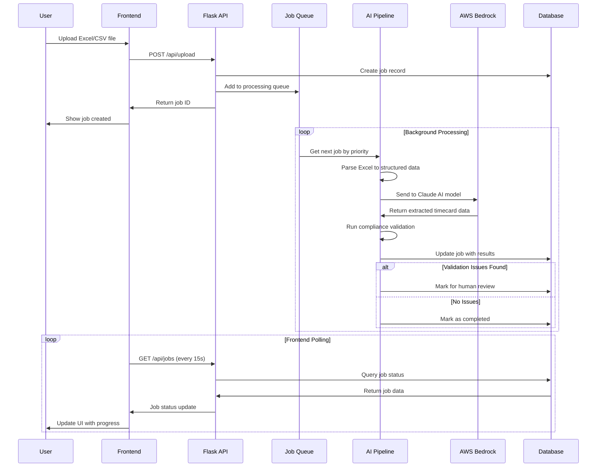

# Timecard Processing System

A scalable, AI-powered timecard processing system built on AWS with automated compliance validation and human-in-the-loop review capabilities.

## Architecture Overview


This solution demonstrates a modern, cloud-native approach to timecard processing using AWS services including ECS Fargate, RDS PostgreSQL, AWS Bedrock, and CloudFront. The system processes Excel/CSV timecard files through an AI pipeline that extracts data, validates compliance with federal wage laws, and routes complex cases for human review.

## Application Logic Flow

### User Journey Flow


**User Journey Explanation:**
This flow represents the complete user experience from file upload to final results. The system automatically handles file validation (checking format, size, and basic structure), creates a job with unique ID and priority level, and queues it for background processing. The AI pipeline extracts timecard data using Claude models and validates against federal wage laws. Jobs that pass validation are automatically completed, while those with compliance issues are routed to human reviewers for manual decision-making. The entire process is asynchronous, allowing users to track progress in real-time through the web interface.

### System Interaction Flow



**System Interaction Explanation:**
This sequence diagram shows the detailed interaction between system components during timecard processing. The frontend communicates with the Flask API through RESTful endpoints, while background workers continuously poll the job queue for new tasks. The AI pipeline processes files through multiple stages: Excel parsing, data extraction via AWS Bedrock's Claude models, and compliance validation against configurable federal wage laws. The system uses database-driven job persistence to ensure reliability across application restarts. Frontend polling occurs every 15 seconds to provide real-time status updates without overwhelming the server.

### AI Processing Pipeline


**AI Processing Pipeline Explanation:**
The AI pipeline transforms raw timecard files into validated, structured data through a sophisticated multi-stage process. Files are first parsed using Pandas to handle various Excel/CSV formats and normalize the data structure. The normalized data is converted to markdown format optimized for AI processing, then sent to Claude AI models (configurable between Opus 4.1, Sonnet 4, or 3.7 Sonnet based on accuracy vs. cost requirements). Claude extracts structured timecard information including employee names, daily rates, hours worked, and calculates totals. The compliance engine then validates this data against federal wage laws: minimum wage compliance ($7.25/hour default), overtime calculations (40+ hours/week), salary exempt thresholds ($684/week), and any custom organizational rules. Jobs with validation issues are automatically flagged for human review, while compliant timecards are approved for immediate processing.

### Key Components

- **Frontend**: React application with AWS Cloudscape Design System
- **Backend**: Python Flask API with asynchronous job processing
- **Database**: PostgreSQL (AWS RDS) for production, SQLite for local development
- **AI Processing**: AWS Bedrock with Claude models for intelligent data extraction
- **Infrastructure**: Fully automated deployment using Terraform
- **Monitoring**: CloudWatch Logs with structured logging and health checks

## Core Application Logic

### Job Processing Architecture

The system implements a robust, asynchronous job processing architecture designed for high throughput and reliability:

#### Job Lifecycle Management
**Job Creation Process:**
When a user uploads a timecard file, the system immediately creates a job record in the database with a unique UUID, assigns priority based on user selection (Urgent=4, High=3, Normal=2, Low=1), and stores the file in S3 with secure access controls. The job starts in "pending" status and enters the priority-based processing queue.

**Queue Processing Logic:**
A background worker continuously polls the database for pending jobs using `ORDER BY priority DESC, created_at ASC` to ensure high-priority jobs are processed first, with FIFO ordering within the same priority level. The system supports 1-10 concurrent workers (configurable via settings), with each worker acquiring jobs atomically to prevent race conditions.

**State Transitions:**
Jobs progress through defined states: Pending → Processing → (Completed|Failed|Review). The system updates job status, progress percentage, and timestamps at each stage, enabling real-time progress tracking in the frontend.

#### AI Processing Pipeline

**Data Extraction Stage:**
The system uses Pandas to parse Excel/CSV files into normalized DataFrames, handling various formats (.xlsx, .xls, .xlsm, .csv) and encoding issues. Data is then converted to a structured markdown format optimized for AI processing, including employee information, daily rates, hours worked, and date ranges.

**AI Model Integration:**
The system integrates with AWS Bedrock's Claude models through configurable model selection:
- **Claude Opus 4.1**: Highest accuracy for complex timecards, slower processing
- **Claude Sonnet 4**: Balanced performance for general use cases  
- **Claude 3.7 Sonnet**: Fastest processing for simple timecards, cost-optimized

The AI prompt is optimized to extract structured JSON data including employee names, daily rates, total days worked, and calculated wages, with built-in validation for data consistency.

**Compliance Validation Engine:**
Post-AI processing, the system runs extracted data through a configurable compliance engine that validates:
- **Federal Minimum Wage**: Ensures daily rates meet or exceed $7.25/hour equivalent
- **Overtime Rules**: Flags weeks exceeding 40 hours for overtime calculation review
- **Salary Exempt Thresholds**: Validates weekly salaries above $684 for exempt status
- **Custom Organizational Rules**: Supports additional validation parameters

#### Human Review Workflow

**Automatic Review Routing:**
Jobs are automatically flagged for human review when:
- Compliance validation fails (wage law violations)
- AI extraction confidence is below threshold
- Data inconsistencies are detected (missing dates, negative values)
- Custom business rules trigger review requirements

**Review Queue Management:**
The review queue presents flagged jobs with detailed validation issues, extracted data preview, and calculated wage information. Human reviewers can approve jobs (marking them as completed) or reject them (marking as failed) with optional comments for audit trails.

**Audit and Compliance Tracking:**
All review decisions are logged with timestamps, reviewer actions, and reasoning for compliance reporting and audit purposes.

#### Database Design and Performance

**Multi-Database Compatibility:**
The system supports both PostgreSQL (production) and SQLite (development) through a unified database abstraction layer. Connection strings are automatically detected via environment variables, enabling seamless deployment across environments.

**Query Optimization:**
Database queries are optimized for performance with proper indexing on frequently queried fields (status, created_at, priority). The system uses connection pooling and prepared statements to minimize database overhead.

**Data Persistence Strategy:**
Job data, including processing results and validation outcomes, is stored as JSONB in PostgreSQL for flexible querying, while maintaining structured fields for performance-critical operations like status filtering and priority sorting.

#### Error Handling and Resilience

**Retry Mechanisms:**
The system implements exponential backoff retry logic for transient failures, including database connection issues, S3 access problems, and AI service timeouts. Failed jobs are automatically retried up to 3 times before being marked as failed.

**Circuit Breaker Pattern:**
AI service calls are protected by circuit breaker logic that temporarily disables processing when AWS Bedrock experiences outages, preventing cascade failures and resource exhaustion.

**Graceful Degradation:**
When AI services are unavailable, the system can optionally route jobs directly to human review queues, ensuring business continuity during service disruptions.

## Features

### Core Functionality

- **Asynchronous Processing**: Upload files and track jobs in real-time with priority queuing
- **AI-Powered Extraction**: Multiple Claude model support (Opus 4.1, Sonnet 4, 3.7 Sonnet)
- **Compliance Validation**: Configurable federal wage law validation with custom parameters
- **Human Review Queue**: Complex cases routed for manual validation with audit trail
- **Multi-format Support**: Excel (.xlsx, .xls, .xlsm) and CSV file processing

### Enterprise Features

- **High Availability**: Multi-AZ deployment with auto-scaling
- **Security**: VPC isolation, IAM roles, encrypted storage
- **Monitoring**: Real-time metrics, health checks, and operational insights
- **Scalability**: Horizontal scaling with ECS Fargate and RDS
- **Cost Optimization**: Automated cleanup policies and resource optimization

## Prerequisites

### Local Development

- Python 3.9+
- Node.js 16+
- Docker
- AWS CLI configured with appropriate permissions

### AWS Deployment

- AWS Account with Bedrock access enabled
- Terraform 1.0+
- Domain registered in Route 53 (optional)
- ACM certificate (automatically provisioned if domain provided)

## Quick Start

### Local Development

```bash
# Clone the repository
git clone <repository-url>
cd timecard-processing-system

# Backend setup
cd backend
pip install -r requirements.txt
python app.py

# Frontend setup (new terminal)
cd frontend
npm install
npm start
```

Access the application at `http://localhost:3000`

### AWS Deployment

```bash
# Navigate to terraform directory
cd terraform

# Configure deployment variables
cp terraform.tfvars.example terraform.tfvars
# Edit terraform.tfvars with your configuration

# Deploy infrastructure
terraform init
terraform plan
terraform apply
```

The deployment process automatically:
1. Creates VPC, subnets, and security groups
2. Provisions RDS PostgreSQL database
3. Sets up ECS Fargate cluster with auto-scaling
4. Builds and pushes Docker images to ECR
5. Deploys React application to S3 and CloudFront
6. Configures Route 53 DNS and ACM certificates

## Configuration

### Environment Variables

#### Production (AWS)
- `DATABASE_URL`: PostgreSQL connection string (automatically configured)
- `AWS_DEFAULT_REGION`: AWS region for services
- `S3_BUCKET`: S3 bucket for file uploads
- `FLASK_ENV`: Set to "production"

#### Development (Local)
- No `DATABASE_URL`: Automatically uses SQLite
- `AWS_REGION`: For Bedrock API calls
- `FLASK_ENV`: Set to "development"

### Terraform Variables

Key configuration options in `terraform.tfvars`:

```hcl
# Project Configuration
project_name = "timecard-processor"
environment  = "prod"
aws_region   = "us-west-2"

# Custom Domain (optional)
domain_name = "timecard.yourdomain.com"

# Database Configuration
db_instance_class = "db.t4g.micro"
db_multi_az       = false

# ECS Configuration
ecs_task_cpu      = 512
ecs_task_memory   = 1024
ecs_desired_count = 2
ecs_min_capacity  = 1
ecs_max_capacity  = 10

# Auto Scaling
enable_auto_scaling = true
```

## API Reference

### Job Management Endpoints

#### Upload and Job Creation
```http
POST /api/upload
Content-Type: multipart/form-data

Parameters:
- file: Excel/CSV file (required, max 16MB)
- priority: Job priority (optional, default: "normal")
  - Values: "low", "normal", "high", "urgent"

Response:
{
  "job_id": "uuid-string",
  "status": "pending",
  "message": "Job created successfully"
}
```

#### Job Status and Management
```http
GET /api/jobs?limit=50&status=completed,pending
Response:
{
  "jobs": [
    {
      "id": "job-uuid",
      "type": "timecard_processing",
      "status": "completed|pending|processing|failed|cancelled",
      "priority": 1-4,
      "file_name": "timecard.xlsx",
      "file_size": 1024000,
      "progress": 100,
      "created_at": "2025-08-18T05:00:00Z",
      "completed_at": "2025-08-18T05:05:00Z",
      "result": {
        "extracted_data": {...},
        "validation": {...}
      }
    }
  ],
  "total": 25
}
```

#### Job Details
```http
GET /api/jobs/{job_id}
Response:
{
  "job": {
    "id": "job-uuid",
    "status": "completed",
    "result": {
      "extracted_data": {
        "employee_name": "John Doe",
        "total_days": 5,
        "daily_rates": [500, 500, 500, 500, 500],
        "unique_days": 5
      },
      "validation": {
        "validation_result": "PASS",
        "total_wage": 2500.00,
        "average_daily_rate": 500.00,
        "requires_human_review": false,
        "validation_issues": []
      }
    }
  }
}
```

### Queue Operations

#### Queue Statistics
```http
GET /api/queue/stats
Response:
{
  "pending": 5,
  "processing": 2,
  "completed": 150,
  "failed": 3,
  "cancelled": 1,
  "review_queue": 8,
  "total_jobs": 169,
  "avg_processing_time": 45,
  "success_rate": 96.2,
  "jobs_today": 25
}
```

#### Human Review Queue
```http
GET /api/review-queue
Response:
{
  "review_queue": [
    {
      "id": "review_job-uuid",
      "job_id": "job-uuid",
      "file_name": "timecard.xlsx",
      "employee_name": "Jane Smith",
      "validation_result": "REQUIRES_HUMAN_REVIEW",
      "validation_issues": [
        "Daily rate below federal minimum wage",
        "Excessive hours detected (65 hours/week)"
      ],
      "total_wage": 1800.00,
      "average_daily_rate": 300.00,
      "total_days": 6,
      "created_at": "2025-08-18T04:30:00Z",
      "status": "pending"
    }
  ],
  "count": 8
}
```

### Settings Management

#### Compliance Configuration
```http
GET /api/settings
Response:
{
  "federal_minimum_wage": 7.25,
  "overtime_threshold_hours": 40,
  "salary_exempt_threshold": 684,
  "max_recommended_hours": 60,
  "claude_model": "us.anthropic.claude-sonnet-4-20250514-v1:0",
  "aws_region": "us-west-2",
  "max_concurrent_jobs": 3,
  "auto_cleanup_days": 7
}
```

#### Update Settings
```http
POST /api/settings
Content-Type: application/json

{
  "federal_minimum_wage": 8.00,
  "claude_model": "anthropic.claude-opus-4-1-20250805-v1:0"
}

Response:
{
  "message": "Settings updated successfully",
  "updated_settings": ["federal_minimum_wage", "claude_model"]
}
```

### Health and Monitoring

#### Health Check
```http
GET /health
Response:
{
  "status": "healthy",
  "service": "timecard-processor",
  "database": "postgresql",
  "queue_stats": {
    "pending": 2,
    "processing": 1,
    "total_jobs": 156
  }
}
```

### Error Responses

All endpoints return consistent error responses:

```http
HTTP 400 Bad Request
{
  "error": "Invalid file format",
  "message": "Only Excel and CSV files are supported",
  "code": "INVALID_FILE_FORMAT"
}

HTTP 404 Not Found
{
  "error": "Job not found",
  "message": "Job with ID 'invalid-uuid' does not exist",
  "code": "JOB_NOT_FOUND"
}

HTTP 500 Internal Server Error
{
  "error": "Processing failed",
  "message": "AI service temporarily unavailable",
  "code": "AI_SERVICE_ERROR"
}
```

## Database Schema

### Jobs Table

| Column | Type | Description |
|--------|------|-------------|
| id | VARCHAR(36) | Unique job identifier |
| type | VARCHAR(100) | Job type (e.g., "timecard_processing") |
| status | VARCHAR(20) | Current job status |
| priority | INTEGER | Job priority (1-4) |
| file_name | VARCHAR(255) | Original filename |
| file_size | BIGINT | File size in bytes |
| created_at | TIMESTAMP | Job creation time |
| updated_at | TIMESTAMP | Last update time |
| started_at | TIMESTAMP | Processing start time |
| completed_at | TIMESTAMP | Processing completion time |
| progress | INTEGER | Progress percentage (0-100) |
| result | JSONB | Processing results |
| error | TEXT | Error message if failed |
| metadata | JSONB | Additional job metadata |

### Settings Table

| Column | Type | Description |
|--------|------|-------------|
| key | VARCHAR(100) | Setting key |
| value | JSONB | Setting value |
| updated_at | TIMESTAMP | Last update time |

## Monitoring and Observability

### CloudWatch Metrics

- ECS service metrics (CPU, memory utilization)
- Application Load Balancer metrics (request count, response time)
- RDS metrics (connections, CPU, storage)
- Custom application metrics via CloudWatch Logs

### Health Checks

- ECS container health checks with configurable parameters
- ALB target group health checks on `/health` endpoint
- Database connection validation in health check response

### Logging

Structured logging with the following log levels:
- `INFO`: Normal operations and job status changes
- `WARNING`: Recoverable errors and retry attempts
- `ERROR`: Unrecoverable errors requiring attention
- `DEBUG`: Detailed debugging information (development only)

## Security Considerations

### Network Security

- VPC with private subnets for application and database tiers
- Security groups with least-privilege access rules
- NAT Gateways for outbound internet access from private subnets
- Application Load Balancer in public subnets only

### Data Protection

- Encryption at rest for RDS and S3
- Encryption in transit with HTTPS/TLS
- IAM roles with minimal required permissions
- S3 bucket policies preventing public access

### Access Control

- ECS tasks run with dedicated IAM roles
- Bedrock access limited to specific model ARNs
- Database credentials managed via environment variables
- CloudFront Origin Access Control for S3 protection

## Cost Optimization

### Resource Optimization

- ECS Fargate with right-sized CPU/memory allocation
- RDS instance class selection based on workload
- S3 lifecycle policies for automatic cleanup
- CloudFront caching to reduce origin requests

### Monitoring and Alerts

- CloudWatch billing alerts for cost monitoring
- Resource utilization metrics for optimization opportunities
- Automated cleanup of old jobs and uploaded files

## Troubleshooting

### Common Issues

#### ECS Task Startup Failures

```bash
# Check ECS service events
aws ecs describe-services --cluster timecard-processor-cluster --services timecard-processor-service

# View container logs
aws logs tail /ecs/timecard-processor --follow
```

#### Database Connection Issues

```bash
# Test database connectivity from ECS task
aws ecs execute-command --cluster timecard-processor-cluster --task <task-id> --interactive --command "/bin/bash"

# Inside container
curl http://localhost:8080/health
```

#### Bedrock Permission Errors

Verify IAM role has required Bedrock permissions:
- `bedrock:InvokeModel`
- `bedrock:InvokeModelWithResponseStream`
- `bedrock:ListFoundationModels`

### Log Analysis

```bash
# Filter logs by error level
aws logs filter-log-events --log-group-name /ecs/timecard-processor --filter-pattern "ERROR"

# Monitor real-time logs
aws logs tail /ecs/timecard-processor --follow --filter-pattern "{ $.level = \"ERROR\" }"
```

## Development

### Local Development Setup

1. **Database**: Uses SQLite automatically when `DATABASE_URL` is not set
2. **AWS Services**: Configure AWS CLI with development credentials
3. **Frontend**: React development server with hot reload
4. **Backend**: Flask development server with auto-reload

### Testing

```bash
# Backend tests
cd backend
python -m pytest tests/

# Frontend tests
cd frontend
npm test

# Integration tests
npm run test:integration
```

### Contributing

1. Fork the repository
2. Create a feature branch (`git checkout -b feature/new-feature`)
3. Commit changes (`git commit -am 'Add new feature'`)
4. Push to branch (`git push origin feature/new-feature`)
5. Create Pull Request

## Deployment Pipeline

### Automated Deployment

The Terraform configuration includes automated deployment triggers:

- **Code Changes**: Detects changes in backend Python files, frontend React files, and Dockerfile
- **Docker Build**: Automatically builds and pushes new images to ECR
- **ECS Update**: Forces new deployment with updated container images
- **Frontend Deploy**: Builds React app and uploads to S3 with CloudFront invalidation

### Manual Deployment

```bash
# Force rebuild and redeploy
terraform apply -replace="null_resource.docker_build_push"

# Update only frontend
terraform apply -target="null_resource.upload_frontend"

# Update only ECS service
terraform apply -target="null_resource.ecs_service_update"
```

## License

This project is licensed under the MIT License. See the [LICENSE](LICENSE) file for details.

## Support

For questions, issues, or contributions:

1. Check existing [Issues](../../issues)
2. Create a new issue with detailed description
3. For security issues, please email [security@example.com](mailto:security@example.com)

## Additional Resources

- [AWS Bedrock Documentation](https://docs.aws.amazon.com/bedrock/)
- [ECS Fargate Best Practices](https://docs.aws.amazon.com/AmazonECS/latest/bestpracticesguide/)
- [Terraform AWS Provider](https://registry.terraform.io/providers/hashicorp/aws/latest/docs)
- [React Cloudscape Design System](https://cloudscape.design/)

---

**Note**: This is a sample application for demonstration purposes. Review and modify security settings, resource configurations, and access policies according to your organization's requirements before deploying to production environments.