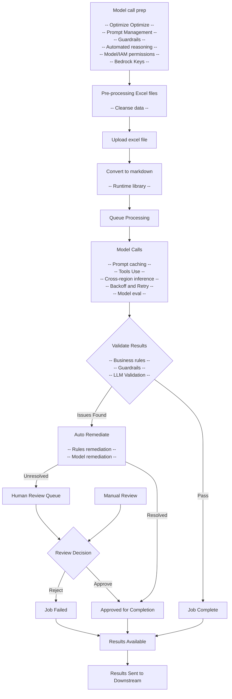

```mermaid
graph TD
    E[Model call prep <br><br> -- Optimize Optimize -- <br> -- Prompt Management -- <br> -- Guardrails -- <br> -- Automated reasoning -- <br> -- Model/IAM permissions -- <br> -- Bedrock Keys --] --> P[Pre-processing Excel files <br><br> -- Cleanse data --]
    P --> A[Upload excel file]
    A --> C[Convert to markdown <br><br> -- Runtime library --]
    C --> D[Queue Processing]
    D --> F[Model Calls <br><br> -- Prompt caching -- <br> -- Tools Use -- <br> -- Cross-region inference -- <br> -- Backoff and Retry -- <br> -- Model eval --]
    F --> G{Validate Results <br><br> -- Business rules -- <br> -- Guardrails -- <br> -- LLM Validation --}
    G -->|Pass| I[Job Complete]
    G -->|Issues Found| R[Auto Remediate <br><br> -- Rules remediation -- <br> -- Model remediation --]
    R -->|Resolved| L[Approved for Completion]
    R -->|Unresolved| J[Human Review Queue]
    J --> K{Review Decision}
    K -->|Approve| L
    K -->|Reject| M[Job Failed]
    H[Manual Review] --> K
    L --> N[Results Available]
    I --> N
    M --> N
    N --> O[Results Sent to Downstream]
```
